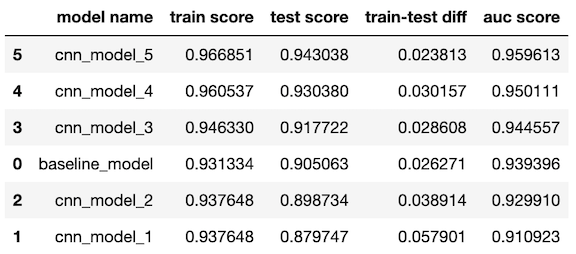

&emsp;&emsp;&emsp;&emsp;&emsp;&emsp;&emsp;&emsp;&emsp;&emsp;&emsp;&emsp;&emsp;&emsp;&emsp;&emsp;&emsp;&emsp;&emsp;&emsp;&emsp;&emsp;&emsp;


# Phase 4 Project

**Author:** Freddy Abrahamson<br>
**Date created:** 7-1-2022<br>
**Discipline:** Data Science
<br><br>

## Overview
***
For this project, I will be comparing different neural network models. I will start with a ANN as a baseline model, and then create CNN(s), to see which is the most successful. 
We have a set of x-rays from both healthy patients, and ones with pneumonia. The goal for the model is to have the highest recall score. Effectively being able to correctly identify as many patients that have pneumonia as possible. 


## Business Problem
***
In the United States about 1.5 million people were diagnosed with pneumonia in an emergency room, in 2018, and around 40,000 people died of pneumonia in that same year. Pneumonia is the world’s leading cause of death among children under 5 years of age, killing approximately 2,400 children a day in 2015. These facts underlie the importance, of not only a correct diagnosis, but a timely one. Now, with the introduction of COVID-19, and it's role as a precursor to pneumonia, the need for a cost effective, non-invasive diagnostic tool is even greater. A model that could correctly identify an x-ray as one of someone with pneumonia, would serve as a cost effective non-invasive tool, that could be used to prioritize which patients the doctor should see first.

https://www.cdc.gov/dotw/pneumonia/index.html<br>
https://www.thoracic.org/patients/patient-resources/resources/top-pneumonia-facts.pdf

## Data Understanding
***
The data was taken from Kaggle.com. There are a total of 5856 images. This includes 1583 'normal' images, and 4273 'pneumonia' images. The ratio of 'pneumonia' images to 'normal' images is about 2.7 : 1. I divided all these images between train , test, and val folders at a ratio of .8:.1:.1 respectively. I maintained the 2.7 to 1 ratio between the 'pneumonia' images and 'normal' images, for all the folders. Once how many of each image would go to each folder was established, all the 'normal', and 'pneumonia' images were chosen randomly. The primary concern with the dataset preparation would be to normalize the image values. All the values were scaled to a range between 0 and 1.


## Modeling
***
I used Keras and Tensorflow to create the models. Given that with the use of the filters, cnn(s) excel at detecting features of various sizes,I chose to use the less apt multi-layer perceptron as a baseline model. I then tried to overfit on purpose using a cnn. I began with a cnn model that has 4 activation layers for the feature extraction part,with the number of nodes for each each layer being 16,32,64, and 128 respectively. I used ReLu as my activation function for all feature detection, as well as for the classification layers. Given that this is a binary classification problem (0 for normal, and 1 for pneumonia), I used a sigmoid function for the output layer. From there, based on the results, I would either try to reduce the bias, by adding a layer, adding more nodes to existing layers, or both; or reduce the variance by increasing the filter size to improve generalizability, or add dropout layers.

## Evaluation
***
Given the importance of correctly identifying a patient with pneumonia, my primary goal was to find a model that produced the best recall scores. To this end, I was looking for a model that would produce the best bias/variance combination between the train and test data sets. I did this by creating a function best_model(), which utilizes the auc() function from sklearn.metrics. The x-axis is represented by the absolute difference between the train and test scores, while the y-axis is represented by the test scores. The higher the test score, and the lower the train-test difference, the greater the area under the curve. The function returns a dataframe with the models, and their respective test scores, sorted by their auc. The model with the highest auc is the best. The secondary goal was a model that would have a good accuracy score, which the 'best' model in fact does, with a score over 90%.

## Importing and Organizing Data
***
I will create two new folders: 'all_normal' and 'all_pneumonia', and copy all the corresponding images from the 'chest_xray' folder to these folders. I will then create a folder called 'train_test_val', with three folders inside of it:'train', 'test', and 'val'. Each of these three folders will have a 'normal', and a 'pneumonia' folder. I will randomly copy the images from the 'all_normal', and 'all_pneumonia' folders, to these three folders, with a split of 80%,10%,10% respectively, keeping the ratio between the number of 'normal' and 'pneumonia' images uniform across all three folders (stratified). The ratio of pneumonia images to normal images is 2.7:1.

The total number of validation images is:  586<br>
The total number of normal validation images is:  158<br>
The total number of pneumonia validation images is:  428<br>

The total number of test images is:  586<br>
The total number of normal test images is:  158<br>
The total number of pneumonia test images is:  428<br> 

The total number of train images is:  4684<br>
The total number of normal train images is:  1267<br>
The total number of pneumonia train images is:  3417<br> 


## Viewing an image
***
View an example of an x-ray of a healthy patient, and one with pneumonia.<br>
&emsp;&emsp;&emsp;&emsp;&emsp;&emsp;&emsp;&emsp;&emsp;&emsp;&emsp;&emsp;&emsp;&emsp;&emsp;&emsp;&emsp;&emsp;&emsp;&emsp;&emsp;&emsp;&emsp;<br>
&emsp;&emsp;&emsp;&emsp;&emsp;&emsp;&emsp;&emsp;&emsp;&emsp;&emsp;&emsp;&emsp;&emsp;&emsp;&emsp;&emsp;&emsp;&emsp;&emsp;&emsp;&emsp;&emsp;
<br><br>

# Neural Network Models

Six models were built all together. One ANN as a baseline model, and another five CNN(s). Below is a summary of the results. The datframe pictured is sorted by auc score. The model with the highest auc score is the model with the best bias-variance balance, and therefore the best model. In this case the best model is cnn_model_5, with a test score of 0.943038, and a train-test difference of 0.023813.<br>
&emsp;&emsp;&emsp;&emsp;&emsp;&emsp;&emsp;&emsp;&emsp;&emsp;&emsp;&emsp;&emsp;

# Best Model Confusion Matrix:
I created a confusion matrix plot for the presentation, as well as an easy way to calculate the accuracy score. With 559 0ut of 586 images correctly classified, this model has an accuracy score of over 95%.

&emsp;&emsp;&emsp;&emsp;&emsp;&emsp;&emsp;&emsp;&emsp;&emsp;&emsp;&emsp;&emsp;&emsp;&emsp;&emsp;&emsp;&emsp;&emsp;&emsp;&emsp;&emsp;&emsp;


# Project Conclusion: Possible Further Steps

Run the model on a larger dataset<br>
Run the model on a balanced datset<br>
Use SMOTE or an image generator to attempt to balance the training data<br>
Create a custom metric that would take into account both precision and accuracy, but give priority to precision<br>


## For More Information
***
Please review my full analysis in [my Jupyter Notebook](./student.ipynb) or my[presentation](./DS_Project_Presentation.pdf).<br>
For any additional questions, please contact **Freddy Abrahamson at fred0421@hotmail.com**,<br><br>

## Repository Structure

```
├── README.md                                    <- The top-level README for reviewers of this project
├── student.ipynb                                <- Narrative documentation of analysis in Jupyter notebook
├── Phase_4_Project_Presentation.pdf             <- PDF version of project presentation
└── images                                       <- Images used for this project
```
